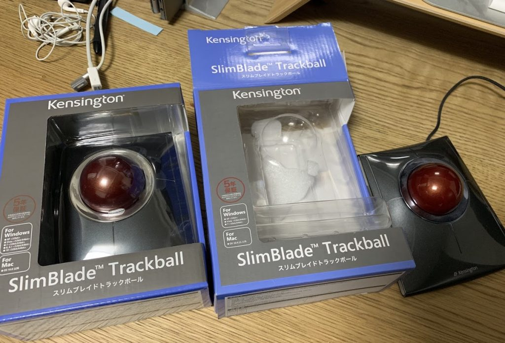

表題の通り4年間使用していたKensingtonのトラックボールの左クリックが反応しなくなってしまったので、「5年保証」を使用して販売元に交換頂いた際の流れを記載。

<!-- truncate -->

左が新規に購入したもの、右の空箱・むき出しのトラックボールが故障品。

4年前に購入した際、日本における販売元は七陽商事 株式会社だったが、現在はアコ・ブランズ・ジャパン株式会社。下記のお問い合わせフォームから故障の旨と製品のシリアル番号を伝えれば良い。（シリアル番号は製品裏に記載)

[https://www.accobrands.co.jp/contact/](https://www.accobrands.co.jp/contact/)

先方から、別途メール連絡があり、購入日から5年以内であることを証明でる納品書・領収書・購入証明書等から1点メールに添付して返信すると、数日中に交換品(新品)が配送される。(私の場合、問い合わせから交換品の配送(到着)まで4日間。迅速なご対応。)

併せて故障品の返送用伝票用紙(佐川急便)があるので着払いで発送を行えば一連の作業は完了となる。
