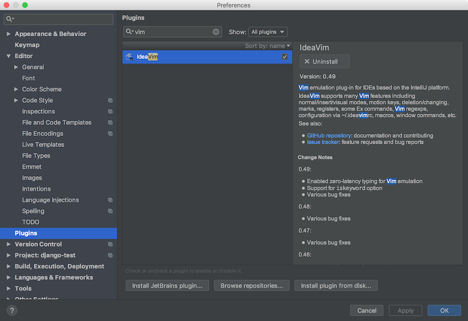

### 事象

PyCharm上で文字の入力前にi, a等を入力しないと編集不可となる。

### 原因

PyCharmのキーバインドの設定がVimになっている為。

### 解決法

<!-- truncate -->

手っ取り早くいくのであれば、ideaVim Pluginsを削除。画面上部のメニューバーPyCharm→Preferences...で設定画面を開き、左側のPlugin設定画面からideaVimを検索・削除する。

