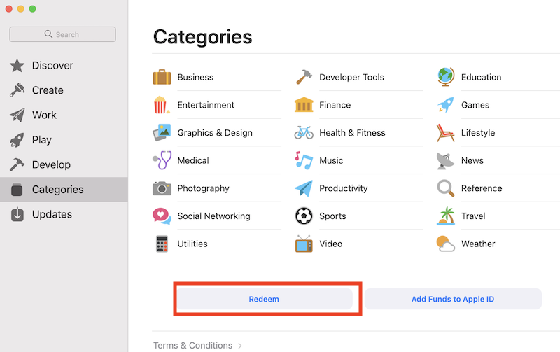
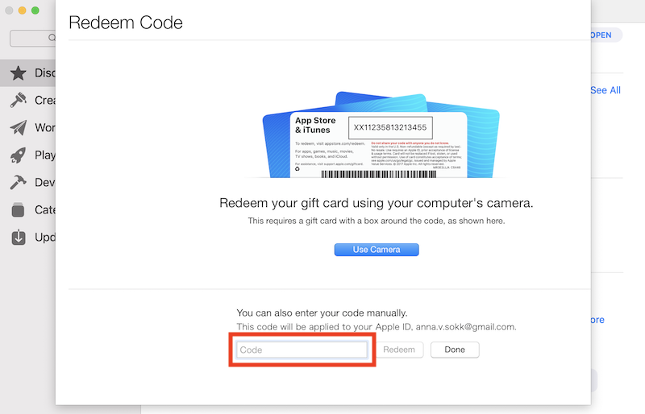
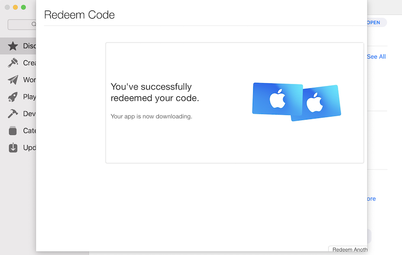
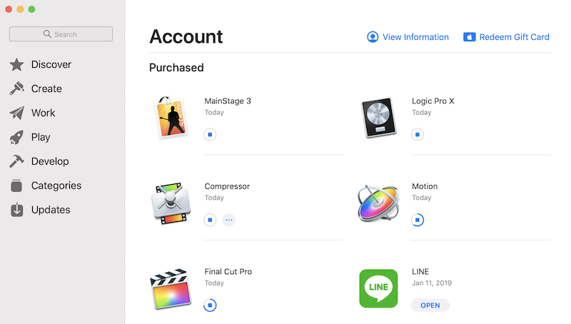

先日妻が所属組織の経費でAppleの教育機関向けPro Appバンドルを購入したのだが、Appダウンロード手法のメール案内が日本語に対して、当人は母国語及びMacの言語設定が英語だった為、ダウンロードに時間を要したこともあり、本記事で簡単にまとめておく。 [教育機関向けPro Appバンドルを購入 - 教育 - Apple（日本）](https://www.apple.com/jp_edu_1460/shop/product/BMGE2J/A/%E6%95%99%E8%82%B2%E6%A9%9F%E9%96%A2%E5%90%91%E3%81%91pro-app%E3%83%90%E3%83%B3%E3%83%89%E3%83%AB)

### Appleからのメール文面

> AppleソフトウェアをMac App Storeでご購入いただけるようになり、ご購入いただいたソフトウェアのエンドユーザへの配布がさらに容易になりました。ソフトウェアをインストールするには、App Storeアプリケーションを起動し、「ナビリンク」カラム中の「iTunes Card/コードを使う」をクリックしてコンテンツコードを入力します。お買い上げいただいた製品のコンテンツコードはこのメールに添付されています。

### Mac App Store画面からの操作方法

何のことは無く、下図の"Redeem"ボタンを押下。  別途受領している、ライセンスコードを入力。  下図の画面が出力されれば、成功している。  左側のメニュー下にある自身のアカウントタブを開くと、下図のようにダウンロードの進捗状況を確認できる。 
