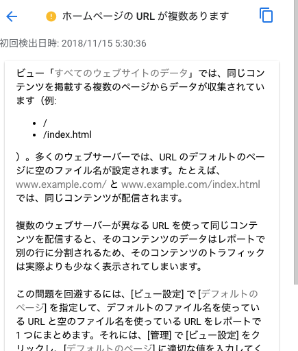

Nginxを使用したWebサーバーに対して、https://example.com/index.htmlでブラウザアクセスした際に、https://example.com/へ301リダイレクト(Permanent Redirect)する設定を紹介。


<!-- truncate -->


### \*.confファイルの設定例

```
server {
  ＜中略＞
  location = /index.html {
    return 301 /;
  }
}

```

"return 301 /"の箇所は"return 301 https://example.com;"と指定しても同様の動作となる。尚、locationディレクティブはserverディレクティブに複数記載可能。

### 設定反映

```
# nginx -t ← コンフィグファイルのテスト
nginx: the configuration file /etc/nginx/nginx.conf syntax is ok
nginx: configuration file /etc/nginx/nginx.conf test is successful
# nginx -s reload ← 設定反映
#

```

### URL正規化の必要性

Google Analytics等のアクセス解析を設定している場合、複数URL(ここでは/ と /index.html)に同一コンテンツがあると、page view countが別々になることやAnalytics側で下図のような警告を出力する為。

[](./google_analytics_url_reg.png)

WordPress等のCMSを使用している場合は、パーマリンクのリダイレクトはプラグイン等で対応できるが、フルスクラッチの静的webサイトでリダイレクトを行う場合は、Webサーバー側の設定で対応する必要がある。

### 参考サイト

- [NGINX Docs | Configuring NGINX Plus as a Web Server](https://docs.nginx.com/nginx/admin-guide/web-server/web-server/)
