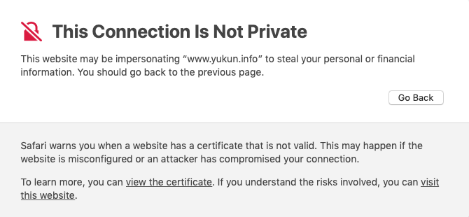

CentOS、Nginxを用いたWebサーバーにおいて、下記のserverディレクティブ設定で後述の事象が発生。


<!-- truncate -->


### 前提環境

Nginxの設定は下記の通り。

#### /etc/nginx/conf.d/dxample.conf

```
server {
  listen 443 ssl http2;
  server_name dxample.com;
  root /srv/dxample;
  ssl_certificate "/etc/letsencrypt/live/dxample.com/fullchain.pem";
  ssl_certificate_key "/etc/letsencrypt/live/dxample.com/privkey.pem";
＜中略＞
}

```

#### /etc/nginx/conf.d/example.conf

```
server {
  listen 443 ssl http2;
  server_name example.com;
  root /srv/example;
  ssl_certificate "/etc/letsencrypt/live/example.com/fullchain.pem";
  ssl_certificate_key "/etc/letsencrypt/live/example.com/privkey.pem";
＜中略＞
}

```

/etc/nginx/conf.d/\*のconfファイルは/etc/nginx/nginx.confファイル中からincludeされているものとする。また、TLS/SSL証明書にはサブドメインなし、及びwwwサブドメインのみの登録がある状態。

### 事象

アドレスhttps://www.example.comでブラウザアクセスすると、下記の警告が表示され/srv/dxampleディレクトリ内のWebページが表示される。

#### Chromeの警告

> Your connection is not private Attackers might be trying to steal your information from www.example.com. NET::ERR\_CERT\_COMMON\_NAME\_INVALID This server could not prove that it is www.example.com; its security certificate is from **dxample.com**. This may be caused by a misconfiguration or an attacker intercepting your connection.

#### Safariの警告

> This Connection Is Not Private This website may be impersonating "www.example.com" to steal your personal or financial information. You should go back to the previous page.

同画面に表示されているview the certificateリンクをクリックすると、証明書ダイアログが表示され、"dxample.com" certificate name does not match inputメッセージを確認できる。

[](./nginx_server_name_error.png)

### 原因

server\_name属性で定義されていないドメインでアクセスされた場合に適用されるserverディレクティブは、アルファベット順で最初に読み込まれたconfファイルのserverディレクティブの為、この場合はdxample.confの定義が適用され/srv/dxampleディレクトリ以下のページを出力するが、TLS/SSL証明書のドメイン(=dxample.com)がブラウザアクセスしているドメイン(=example.com)と異なる為、警告を出力している。

### 解決法

サブドメインをserver\_name属性に指定する。下記の例ではワイルドカード"\*"を指定することで、どのサブドメインでアクセスされても、/srv/exampleディレクトリ以下のデータを参照させている。

#### /etc/nginx/conf.d/example.conf

```
server {
  listen 443 ssl http2;
  server_name example.com *.example.com;
  root /srv/example;
＜中略＞
}

```

SEOやURL正規化を行う場合、ここから\*.example.com → example.comへリダイレクトさせるが、本記事の趣旨とは外れる為ここでは割愛する。
