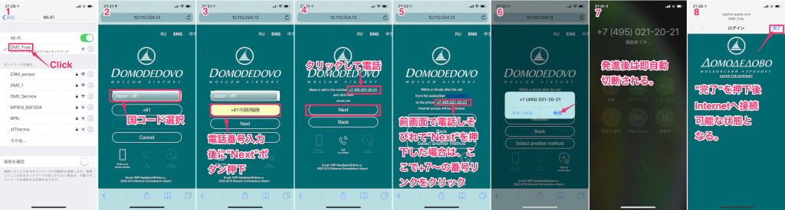

3月初に連続休暇を取得できた為、ロシア・モスクワへ帰省。その際に降り立ったドモジェドヴォ空港の無料WiFi接続方法について紹介する。

<!-- truncate -->

接続方法についてはiPhoneをベースとしているが、Androidも要領は同じ。

文書でステップを記載すると後述の通りとなる。

1. 設定 --> Wi-Fi画面からアクセスポイント"DME\_Free"をクリック。
2. 端末認証用のウィザード画面がブラウザ(iPhoneはSafari)が立ち上がるので、自分のSIMに登録されている電話場号の国コードを入力、自分の電話番号を入力後に"Next"を押下。
3. 表視された認証先電話番号(+7〜)をタップして電話をかける。実際には即切断される。
4. Safariの画面が認証完了の画面へ遷移しWiFiがインターネットに接続される。

特に問題なければ入国審査ゲートの行列待ち時間内に完了する。DME\_Freeアクセスポイントは空港内をカバーしているが、2Fの一部の待合席は電波が弱かった。
