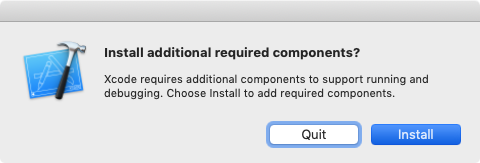

表題の通り、macOS上でmysqlclientのインストールを試みたところ下記のエラーが発生。本記事はその解決法を記載するもの。

追記(2019-12-28): macOS Catelinaアップグレード後に事象が再発した為、対処法を下記リンク先に追記しました。 [Python: macOS (Catalina)でのpip install mysqlclient エラーの解決法](/blog/python-pip-install-mysqlclient-catalina)


<!-- truncate -->


### エラーメッセージ

```
(venv) $ pip install mysqlclient
Collecting mysqlclient
  Using cached https://files.pythonhosted.org/packages/f4/f1/3bb6f64ca7a429729413e6556b7ba5976df06019a5245a43d36032f1061e/mysqlclient-1.4.2.post1.tar.gz
Installing collected packages: mysqlclient
  Running setup.py install for mysqlclient ... error
    ERROR: Complete output from command /Users/XXX/PycharmProjects/sskcoin/venv/bin/python -u -c 'import setuptools, tokenize;__file__='"'"'/private/var/folders/b5/cl371z9s20bdmwtprsx2nn6h0000gn/T/pip-install-0rinc16y/mysqlclient/setup.py'"'"';f=getattr(tokenize, '"'"'open'"'"', open)(__file__);code=f.read().replace('"'"'\r\n'"'"', '"'"'\n'"'"');f.close();exec(compile(code, __file__, '"'"'exec'"'"'))' install --record /private/var/folders/b5/cl371z9s20bdmwtprsx2nn6h0000gn/T/pip-record-89g2orip/install-record.txt --single-version-externally-managed --compile --install-headers /Users/XXX/PycharmProjects/sskcoin/venv/include/site/python3.7/mysqlclient:
    ERROR: running install
    running build
    running build_py
    creating build
    creating build/lib.macosx-10.14-x86_64-3.7
    creating build/lib.macosx-10.14-x86_64-3.7/MySQLdb
    copying MySQLdb/__init__.py -> build/lib.macosx-10.14-x86_64-3.7/MySQLdb
    copying MySQLdb/_exceptions.py -> build/lib.macosx-10.14-x86_64-3.7/MySQLdb
    copying MySQLdb/compat.py -> build/lib.macosx-10.14-x86_64-3.7/MySQLdb
    copying MySQLdb/connections.py -> build/lib.macosx-10.14-x86_64-3.7/MySQLdb
    copying MySQLdb/converters.py -> build/lib.macosx-10.14-x86_64-3.7/MySQLdb
    copying MySQLdb/cursors.py -> build/lib.macosx-10.14-x86_64-3.7/MySQLdb
    copying MySQLdb/release.py -> build/lib.macosx-10.14-x86_64-3.7/MySQLdb
    copying MySQLdb/times.py -> build/lib.macosx-10.14-x86_64-3.7/MySQLdb
    creating build/lib.macosx-10.14-x86_64-3.7/MySQLdb/constants
    copying MySQLdb/constants/__init__.py -> build/lib.macosx-10.14-x86_64-3.7/MySQLdb/constants
    copying MySQLdb/constants/CLIENT.py -> build/lib.macosx-10.14-x86_64-3.7/MySQLdb/constants
    copying MySQLdb/constants/CR.py -> build/lib.macosx-10.14-x86_64-3.7/MySQLdb/constants
    copying MySQLdb/constants/ER.py -> build/lib.macosx-10.14-x86_64-3.7/MySQLdb/constants
    copying MySQLdb/constants/FIELD_TYPE.py -> build/lib.macosx-10.14-x86_64-3.7/MySQLdb/constants
    copying MySQLdb/constants/FLAG.py -> build/lib.macosx-10.14-x86_64-3.7/MySQLdb/constants
    running build_ext
    building 'MySQLdb._mysql' extension
    creating build/temp.macosx-10.14-x86_64-3.7
    creating build/temp.macosx-10.14-x86_64-3.7/MySQLdb
    clang -Wno-unused-result -Wsign-compare -Wunreachable-code -fno-common -dynamic -DNDEBUG -g -fwrapv -O3 -Wall -isysroot /Applications/Xcode.app/Contents/Developer/Platforms/MacOSX.platform/Developer/SDKs/MacOSX10.14.sdk -I/Applications/Xcode.app/Contents/Developer/Platforms/MacOSX.platform/Developer/SDKs/MacOSX10.14.sdk/usr/include -I/Applications/Xcode.app/Contents/Developer/Platforms/MacOSX.platform/Developer/SDKs/MacOSX10.14.sdk/System/Library/Frameworks/Tk.framework/Versions/8.5/Headers -Dversion_info=(1,4,2,'post',1) -D__version__=1.4.2.post1 -I/usr/local/Cellar/mariadb/10.3.14/include/mysql -I/usr/local/Cellar/mariadb/10.3.14/include/mysql/.. -I/Users/XXX/PycharmProjects/sskcoin/venv/include -I/usr/local/Cellar/python/3.7.3/Frameworks/Python.framework/Versions/3.7/include/python3.7m -c MySQLdb/_mysql.c -o build/temp.macosx-10.14-x86_64-3.7/MySQLdb/_mysql.o
    clang -bundle -undefined dynamic_lookup -isysroot /Applications/Xcode.app/Contents/Developer/Platforms/MacOSX.platform/Developer/SDKs/MacOSX10.14.sdk build/temp.macosx-10.14-x86_64-3.7/MySQLdb/_mysql.o -L/usr/local/Cellar/mariadb/10.3.14/lib -lmariadb -lz -liconv -lssl -lcrypto -o build/lib.macosx-10.14-x86_64-3.7/MySQLdb/_mysql.cpython-37m-darwin.so
    ld: library not found for -lssl
    clang: error: linker command failed with exit code 1 (use -v to see invocation)
    error: command 'clang' failed with exit status 1
    ----------------------------------------
ERROR: Command "/Users/XXX/PycharmProjects/sskcoin/venv/bin/python -u -c 'import setuptools, 
tokenize;__file__='"'"'/private/var/folders/b5/cl371z9s20bdmwtprsx2nn6h0000gn/T/pip-install-0rinc16y/mysqlclient/setup.py'"'"';f=getattr(tokenize, '"'"'open'"'"', open)(__file__);code=f.read().replace('"'"'\r\n'"'"', 
'"'"'\n'"'"');f.close();exec(compile(code, __file__, '"'"'exec'"'"'))' install --record /private/var/folders/b5/cl371z9s20bdmwtprsx2nn6h0000gn/T/pip-record-89g2orip/install-record.txt 
--single-version-externally-managed --compile --install-headers /Users/XXX/PycharmProjects/sskcoin/venv/include/site/python3.7/mysqlclient" failed with error code 1 in /private/var/folders/b5/cl371z9s20bdmwtprsx2nn6h0000gn/T/pip-install-0rinc16y/mysqlclient/

```

もしくは、下記のエラー。

```
(venv) $ pip install mysqlclient
Collecting mysqlclient
  Using cached https://files.pythonhosted.org/packages/f4/f1/3bb6f64ca7a429729413e6556b7ba5976df06019a5245a43d36032f1061e/mysqlclient-1.4.2.post1.tar.gz
    ERROR: Complete output from command python setup.py egg_info:
    ERROR: Traceback (most recent call last):
      File "", line 1, in 
      File "/private/var/folders/b5/cl371z9s20bdmwtprsx2nn6h0000gn/T/pip-install-ig29tfrd/mysqlclient/setup.py", line 16, in 
        metadata, options = get_config()
      File "/private/var/folders/b5/cl371z9s20bdmwtprsx2nn6h0000gn/T/pip-install-ig29tfrd/mysqlclient/setup_posix.py", line 53, in get_config
        libraries = [dequote(i[2:]) for i in libs if i.startswith('-l')]
      File "/private/var/folders/b5/cl371z9s20bdmwtprsx2nn6h0000gn/T/pip-install-ig29tfrd/mysqlclient/setup_posix.py", line 53, in 
        libraries = [dequote(i[2:]) for i in libs if i.startswith('-l')]
      File "/private/var/folders/b5/cl371z9s20bdmwtprsx2nn6h0000gn/T/pip-install-ig29tfrd/mysqlclient/setup_posix.py", line 12, in dequote
        raise Exception("Wrong MySQL configuration: maybe https://bugs.mysql.com/bug.php?id=86971 ?")
    Exception: Wrong MySQL configuration: maybe https://bugs.mysql.com/bug.php?id=86971 ?
    ----------------------------------------
ERROR: Command "python setup.py egg_info" failed with error code 1 in /private/var/folders/b5/cl371z9s20bdmwtprsx2nn6h0000gn/T/pip-install-ig29tfrd/mysqlclient/
(venv) $ 

```

### 発生環境

macOS 10.14.4、Python 3.7、pip 19.1

### 解決法

ld: library not found for -lssl等、色々とエラーが出ているが、順々に対応していくと以下の通りとなる。

```
xcode-select --install

```

もしくは、Xcodeを起動時にadditional componentsのインストールダイアログが表示されるので、そこでインストール。 [](./xcode_install_additional.png)

```
brew install mysql-connector-c

```

mysql-connector-cインストール時に下記のメッセージが表示される場合は、競合対象をアンインストールする。この場合はMariaDB。

```
Error: Cannot install mysql-connector-c because conflicting formulae are installed.
  mariadb: because both install MySQL client libraries

Please `brew unlink mariadb` before continuing.

Unlinking removes a formula's symlinks from /usr/local. You can
link the formula again after the install finishes. You can --force this
install, but the build may fail or cause obscure side effects in the
resulting software.
$ brew uninstall mariadb
Uninstalling /usr/local/Cellar/mariadb/10.3.14... (657 files, 169.5MB)
$ brew install mysql-connector-c
==> Downloading https://homebrew.bintray.com/bottles/mysql-connector-c-6.1.11.mojave.bottle.tar.gz
==> Downloading from 
######################################################################## 100.0%
==> Pouring mysql-connector-c-6.1.11.mojave.bottle.tar.gz
🍺  /usr/local/Cellar/mysql-connector-c/6.1.11: 79 files, 15.3MB
$
```

続いてmysql\_configファイルの修正を行う。

```
sudo vim /usr/local/bin/mysql_config 
```

該当箇所を下記の通り変更。

修正前：

```
# Create options 
libs="-L$pkglibdir"
libs="$libs -l "
```

修正後：

```
# Create options 
libs="-L$pkglibdir"
libs="$libs -lmysqlclient -lssl -lcrypto"
```

最後にopensslの環境変数設定。

```
brew info openssl

```

出力結果に記載のパスを環境変数へ登録し(~/.bash\_profileなど)、再読み込み。もしくはログオフ・ログオン。

最後に再度pipでインストールコマンドを再実行し、エラーが無いことを確認する。

```
(venv) $ pip install mysqlclient
Collecting mysqlclient
  Using cached https://files.pythonhosted.org/packages/f4/f1/3bb6f64ca7a429729413e6556b7ba5976df06019a5245a43d36032f1061e/mysqlclient-1.4.2.post1.tar.gz
Installing collected packages: mysqlclient
  Running setup.py install for mysqlclient ... done
Successfully installed mysqlclient-1.4.2.post1
(venv) $ 

```

### 参考サイト

- [Python mac安装mysqlclient的一个bug - dandyzhang - 博客园](https://www.cnblogs.com/wuzdandz/p/9712865.html)

- [python - MySQLClient instal error: "raise Exception("Wrong MySQL configuration: maybe https://bugs.mysql.com/bug.php?id" - Stack Overflow](https://stackoverflow.com/questions/51578425/mysqlclient-instal-error-raise-exceptionwrong-mysql-configuration-maybe-htt)
