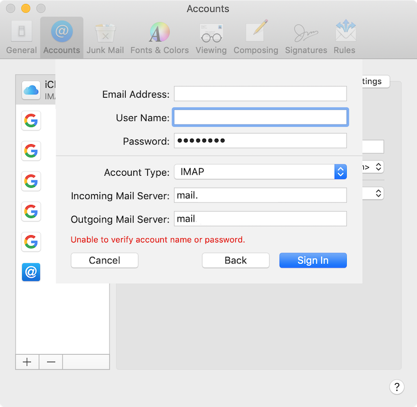

CentOS 上にDovecotを用いてIMAP / IMAPSサーバーを構築後にMacOSの標準メールソフト(Mail)よりアカウント登録を試みたところ、下記のエラーが発生しアカウント登録に失敗、及びメールの受信が不可となった。


<!-- truncate -->


### 事象

下図のEmail Address, Mail Server欄は伏せている。エラーメッセージは"Unable to verify account name or password."。



### 原因

サーバー上の/var/log/maillogを確認したところ、以下の通りuser欄が指定されていなかった為(user=<>)。


```bash
Dec 16 19:53:03 ht2-100-11111 dovecot: imap-login: 
Aborted login (no auth attempts in 1 secs): user=<>, 
rip=xxx.xx.xxx.xxx, lip=yyy.yy.yyy.yy, TLS, session=<O7sEBNHRSGejMctw>
```


### 解決策

Accounts登録画面上のUser NameはMail上だとOptionalだが、Dovecotとしては必須のパラメーターの為、明示的に設定(emailアドレス)することで事象解消する。


```bash
Dec 16 19:53:03 ht2-100-11111 dovecot: imap-login: 
Login: user=<mail@example.com>, method=CRAM-MD5, 
rip=xxx.xx.xxx.xxx, lip=yyy.yy.yyy.yy, mpid=481, TLS, session=<Zu0MgasCZoijMctw>
```


