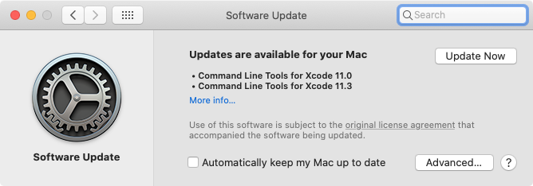
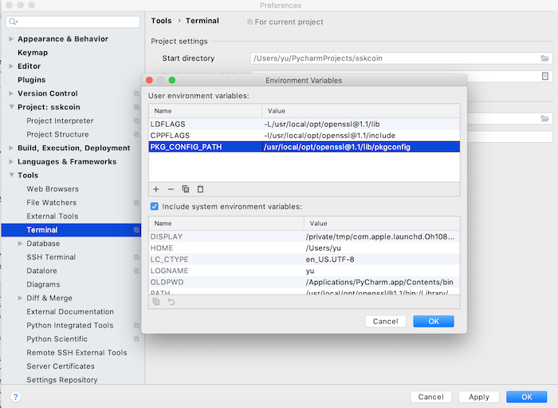

先日開発環境であるmacOSをCatalinaへアップグレード後にPyCharmでDjango環境の再構築を試みたところ、mysqlclientライブラリのインストールで下記のエラーが発生。


<!-- truncate -->


### 事象 (エラーメッセージ)


```bash
 Collecting mysqlclient==1.4.6 Using cached https://files.pythonhosted.org/packages/d0/97/7326248ac8d5049968bf4ec708a5d3d4806e412a42e74160d7f266a3e03a/mysqlclient-1.4.6.tar.gz Installing collected packages: mysqlclient Running setup.py install for mysqlclient: started Running setup.py install for mysqlclient: finished with status 'error'

ERROR: Command errored out with exit status 1: command: /Users/yu/PycharmProjects/sskcoin/venv/bin/python -u -c 'import sys, setuptools, tokenize; sys.argv[0] = '"'"'/private/var/folders/b5/cl371z9s20bdmwtprsx2nn6h0000gn/T/pycharm-packaging/mysqlclient/setup.py'"'"'; __file__='"'"'/private/var/folders/b5/cl371z9s20bdmwtprsx2nn6h0000gn/T/pycharm-packaging/mysqlclient/setup.py'"'"';f=getattr(tokenize, '"'"'open'"'"', open)(__file__);code=f.read().replace('"'"'\r\n'"'"', '"'"'\n'"'"');f.close();exec(compile(code, __file__, '"'"'exec'"'"'))' install --record /private/var/folders/b5/cl371z9s20bdmwtprsx2nn6h0000gn/T/pip-record-8kd13qk4/install-record.txt --single-version-externally-managed --compile --install-headers /Users/yu/PycharmProjects/sskcoin/venv/include/site/python3.8/mysqlclient cwd: /private/var/folders/b5/cl371z9s20bdmwtprsx2nn6h0000gn/T/pycharm-packaging/mysqlclient/ Complete output (32 lines): running install running build running build_py creating build creating build/lib.macosx-10.9-x86_64-3.8 creating build/lib.macosx-10.9-x86_64-3.8/MySQLdb copying MySQLdb/__init__.py -> build/lib.macosx-10.9-x86_64-3.8/MySQLdb copying MySQLdb/_exceptions.py -> build/lib.macosx-10.9-x86_64-3.8/MySQLdb copying MySQLdb/compat.py -> build/lib.macosx-10.9-x86_64-3.8/MySQLdb copying MySQLdb/connections.py -> build/lib.macosx-10.9-x86_64-3.8/MySQLdb copying MySQLdb/converters.py -> build/lib.macosx-10.9-x86_64-3.8/MySQLdb copying MySQLdb/cursors.py -> build/lib.macosx-10.9-x86_64-3.8/MySQLdb copying MySQLdb/release.py -> build/lib.macosx-10.9-x86_64-3.8/MySQLdb copying MySQLdb/times.py -> build/lib.macosx-10.9-x86_64-3.8/MySQLdb creating build/lib.macosx-10.9-x86_64-3.8/MySQLdb/constants copying MySQLdb/constants/__init__.py -> build/lib.macosx-10.9-x86_64-3.8/MySQLdb/constants copying MySQLdb/constants/CLIENT.py -> build/lib.macosx-10.9-x86_64-3.8/MySQLdb/constants copying MySQLdb/constants/CR.py -> build/lib.macosx-10.9-x86_64-3.8/MySQLdb/constants copying MySQLdb/constants/ER.py -> build/lib.macosx-10.9-x86_64-3.8/MySQLdb/constants copying MySQLdb/constants/FIELD_TYPE.py -> build/lib.macosx-10.9-x86_64-3.8/MySQLdb/constants copying MySQLdb/constants/FLAG.py -> build/lib.macosx-10.9-x86_64-3.8/MySQLdb/constants warning: build_py: byte-compiling is disabled, skipping. running build_ext building 'MySQLdb._mysql' extension creating build/temp.macosx-10.9-x86_64-3.8 creating build/temp.macosx-10.9-x86_64-3.8/MySQLdb gcc -Wno-unused-result -Wsign-compare -Wunreachable-code -fno-common -dynamic -DNDEBUG -g -fwrapv -O3 -Wall -arch x86_64 -g -Dversion_info=(1,4,6,'final',0) -D__version__=1.4.6 -I/usr/local/Cellar/mysql/8.0.18_1/include/mysql -I/Users/yu/PycharmProjects/sskcoin/venv/include -I/Library/Frameworks/Python.framework/Versions/3.8/include/python3.8 -c MySQLdb/_mysql.c -o build/temp.macosx-10.9-x86_64-3.8/MySQLdb/_mysql.o gcc -bundle -undefined dynamic_lookup -arch x86_64 -g build/temp.macosx-10.9-x86_64-3.8/MySQLdb/_mysql.o -L/usr/local/Cellar/mysql/8.0.18_1/lib -lmysqlclient -lssl -lcrypto -o build/lib.macosx-10.9-x86_64-3.8/MySQLdb/_mysql.cpython-38-darwin.so ld: library not found for -lssl clang: error: linker command failed with exit code 1 (use -v to see invocation) error: command 'gcc' failed with exit status 1 ---------------------------------------- ERROR: Command errored out with exit status 1: /Users/yu/PycharmProjects/sskcoin/venv/bin/python -u -c 'import sys, setuptools, tokenize; sys.argv[0] = '"'"'/private/var/folders/b5/cl371z9s20bdmwtprsx2nn6h0000gn/T/pycharm-packaging/mysqlclient/setup.py'"'"'; __file__='"'"'/private/var/folders/b5/cl371z9s20bdmwtprsx2nn6h0000gn/T/pycharm-packaging/mysqlclient/setup.py'"'"';f=getattr(tokenize, '"'"'open'"'"', open)(__file__);code=f.read().replace('"'"'\r\n'"'"', '"'"'\n'"'"');f.close();exec(compile(code, __file__, '"'"'exec'"'"'))' install --record /private/var/folders/b5/cl371z9s20bdmwtprsx2nn6h0000gn/T/pip-record-8kd13qk4/install-record.txt --single-version-externally-managed --compile --install-headers /Users/yu/PycharmProjects/sskcoin/venv/include/site/python3.8/mysqlclient Check the logs for full command output. 
```


### 発生環境

macOS 10.15.2, PyCharm 2019.3, Python 3.8.1, pip 19.3.1, mysqlclient 1.4.6

### 原因

- Command Line Tools for Xcodeが未インストール
- mysqlクライアントが未インストール
- OpenSSLライブラリの環境変数が未設定

アップグレード前はCommand Line Toolsやmysqlクライアント等をインストールした筈なのだが。(過去記事)→[Django: macOSでのpip install mysqlclient エラーの解決法](/blog/pip-install-mysqlclient-error)

### 解決方法

#### Command Line Tools for Xcodeのインストール


```bash
 xcode-select --install 
```


コマンド実行後に下記のプロンプトが表示されるので、installボタンを押下。


時期によってはSoftware Updateでtoolsのupdate通知があるので最新版までアップデートしておく。



#### mysqlクライアントのインストール

brewコマンドでインストールを行う。


```bash
 % brew install mysql ==> Installing dependencies for mysql: protobuf@3.7 ==> Installing mysql dependency: protobuf@3.7 ==> Downloading https://homebrew.bintray.com/bottles/protobuf@3.7-3.7.1_1.mojave.bottle.tar.gz ==> Downloading from ######################################################################## 100.0% ==> Pouring protobuf@3.7-3.7.1_1.mojave.bottle.tar.gz ==> Caveats protobuf@3.7 is keg-only, which means it was not symlinked into /usr/local, because this is an alternate version of another formula.

If you need to have protobuf@3.7 first in your PATH run: echo 'export PATH="/usr/local/opt/protobuf@3.7/bin:$PATH"' >> ~/.zshrc

For compilers to find protobuf@3.7 you may need to set: export LDFLAGS="-L/usr/local/opt/protobuf@3.7/lib" export CPPFLAGS="-I/usr/local/opt/protobuf@3.7/include"

For pkg-config to find protobuf@3.7 you may need to set: export PKG_CONFIG_PATH="/usr/local/opt/protobuf@3.7/lib/pkgconfig"

\==> Summary 🍺 /usr/local/Cellar/protobuf@3.7/3.7.1_1: 264 files, 18.5MB ==> Installing mysql ==> Downloading https://homebrew.bintray.com/bottles/mysql-8.0.18_1.catalina.bottle.1.tar.gz ==> Downloading from ######################################################################## 100.0% ==> Pouring mysql-8.0.18_1.catalina.bottle.1.tar.gz ==> Caveats We've installed your MySQL database without a root password. To secure it run: mysql_secure_installation

MySQL is configured to only allow connections from localhost by default

To connect run: mysql -uroot

To have launchd start mysql now and restart at login: brew services start mysql Or, if you don't want/need a background service you can just run: mysql.server start ==> Summary 🍺 /usr/local/Cellar/mysql/8.0.18_1: 287 files, 278.6MB ==> Caveats ==> protobuf@3.7 protobuf@3.7 is keg-only, which means it was not symlinked into /usr/local, because this is an alternate version of another formula.

If you need to have protobuf@3.7 first in your PATH run: echo 'export PATH="/usr/local/opt/protobuf@3.7/bin:$PATH"' >> ~/.zshrc

For compilers to find protobuf@3.7 you may need to set: export LDFLAGS="-L/usr/local/opt/protobuf@3.7/lib" export CPPFLAGS="-I/usr/local/opt/protobuf@3.7/include"

For pkg-config to find protobuf@3.7 you may need to set: export PKG_CONFIG_PATH="/usr/local/opt/protobuf@3.7/lib/pkgconfig"

\==> mysql We've installed your MySQL database without a root password. To secure it run: mysql_secure_installation

MySQL is configured to only allow connections from localhost by default

To connect run: mysql -uroot

To have launchd start mysql now and restart at login: brew services start mysql Or, if you don't want/need a background service you can just run: mysql.server start 
```


#### OpenSSLライブラリの環境変数の設定

先ずは環境変数の確認を行う。


```bash
 % brew info openssl openssl@1.1: stable 1.1.1d (bottled) [keg-only] Cryptography and SSL/TLS Toolkit https://openssl.org/ /usr/local/Cellar/openssl@1.1/1.1.1d (7,983 files, 17.9MB) Poured from bottle on 2019-11-01 at 19:51:33 From: https://github.com/Homebrew/homebrew-core/blob/master/Formula/openssl@1.1.rb ==> Caveats A CA file has been bootstrapped using certificates from the system keychain. To add additional certificates, place .pem files in /usr/local/etc/openssl@1.1/certs

and run /usr/local/opt/openssl@1.1/bin/c_rehash

openssl@1.1 is keg-only, which means it was not symlinked into /usr/local, because openssl/libressl is provided by macOS so don't link an incompatible version.

If you need to have openssl@1.1 first in your PATH run: echo 'export PATH="/usr/local/opt/openssl@1.1/bin:$PATH"' >> ~/.zshrc

For compilers to find openssl@1.1 you may need to set: export LDFLAGS="-L/usr/local/opt/openssl@1.1/lib" export CPPFLAGS="-I/usr/local/opt/openssl@1.1/include"

For pkg-config to find openssl@1.1 you may need to set: export PKG_CONFIG_PATH="/usr/local/opt/openssl@1.1/lib/pkgconfig"

\==> Analytics install: 478,952 (30 days), 1,627,695 (90 days), 2,653,948 (365 days) install-on-request: 83,221 (30 days), 166,771 (90 days), 458,497 (365 days) build-error: 0 (30 days) 
```


後は環境変数を設定の上、pipコマンドでインストールすることで本事象は解消する。PyCharmを使用している場合はメニューからPyCharm → Preferences → Tools → Terminal画面のProject settings → Environment Variables欄でプロジェクト用の環境変数を設定できるので、設定しておくと毎度のexportコマンド実行を省ける。



設定後はPyCharmを再起動することで、環境変数を読み込んだ状態でTerminal操作が可能となる。試しに変数の設定状態を書くにしたい場合はechoコマンドを用いる。


```bash
 (venv) % echo $LDFLAGS -L/usr/local/opt/openssl@1.1/lib 
```


最後にpipコマンドでmysqlclientをインストールする。


```bash
 (venv) % pip install mysqlclient Collecting mysqlclient Using cached https://files.pythonhosted.org/packages/d0/97/7326248ac8d5049968bf4ec708a5d3d4806e412a42e74160d7f266a3e03a/mysqlclient-1.4.6.tar.gz Installing collected packages: mysqlclient Running setup.py install for mysqlclient ... done Successfully installed mysqlclient-1.4.6 
```


