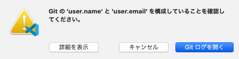
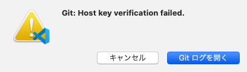
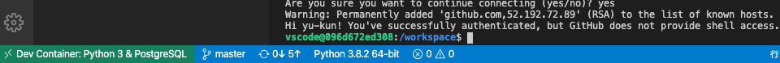

Mac OS 10.15.4, Visual Studio Code v1.44.2において、リモートコンテナ(dev container)上からソースコードをGitリポジトリへコミット、GitHubへプッシュを試みたところ、下記のエラーが発生しコミット及びプッシュが完了しない事象が発生。


<!-- truncate -->


### エラーメッセージ


```bash
 Run

git config --global user.email "you@example.com" git config --global user.name "Your Name"

to set your account's default identity. Omit --global to set the identity only in this repository.

fatal: unable to auto-detect email address (got 'vscode@97eafea5e679.(none)') > git config --get-all user.name > git config --get-all user.email ＜後略＞ 
```




上記の対処法としては、記載の通りローカル環境で(≠リモートコンテナ環境)でgit configでemail, user nameを設定し、Rebuild Containerを実行することでローカルの.gitconfigがコンテナへ引き継がれ再コミット時はエラー解決する。しかし、プッシュ時には下記のエラーが発生するようになる。


```bash
 ＜前略＞ > git push origin master:master Host key verification failed. fatal: Could not read from remote repository.

Please make sure you have the correct access rights and the repository exists. > git fetch Host key verification failed. fatal: Could not read from remote repository.

Please make sure you have the correct access rights and the repository exists. ＜後略＞ 
```




### 原因と解決法

原因は記載の通り、Host key認証失敗だがgit関連の認証設定を特にしていない場合、先ずは下記公式ドキュメントを参考に設定を行う。

[Developing inside a Container using Visual Studio Code Remote Development](https://code.visualstudio.com/docs/remote/containers#_sharing-git-credentials-with-your-container)

私の環境ではGitHubに二段階認証を設定していた為、credential helper configuredではなく、SSH agent手法でGitHub認証用の秘密鍵を登録する。(事前に対となる公開鍵はについてはすでにGitHub上に登録済みの前提で後述の作業を行う)


```bash
% ssh-add -l
The agent has no identities.
% ssh-add $HOME/.ssh/id_rsa
Identity added: /Users/xxx/.ssh/id_rsa (/Users/xxx/.ssh/id_rsa)
% ssh-add -l
4096 SHA256:gqtj+gasge+tvvW9Tqke56uerdftsqo8o7kTdkSDYc /Users/xxx/.ssh/id_rsa (RSA)
%
```


その後、改めてコンテ上のターミナルでgithub.comのfingerprintを登録する。


```bash
vscode@096d672ed308:/workspace$ ssh -T git@github.com
The authenticity of host 'github.com (52.192.72.89)' can't be established.
RSA key fingerprint is SHA256:nThb3kXUpJWgwagwtagwagxdCARLviKw6E5SY8.
Are you sure you want to continue connecting (yes/no)? yes
Warning: Permanently added 'github.com,52.192.72.89' (RSA) to the list of known hosts.
Hi xxx! You've successfully authenticated, but GitHub does not provide shell access.
```


その後に改めてプッシュ(push)を行うと正常完了する。



### Mac OS 再起動後もSSH agentの登録鍵を利用

下記リンク先のGitHub公式ヘルプ No.2に記載の通り、~/.ssh/configファイルのIdentityFileディレクティブへ秘密鍵のパスを指定しておけば良い。

[Generating a new SSH key and adding it to the ssh-agent - GitHub Help](https://help.github.com/en/github/authenticating-to-github/generating-a-new-ssh-key-and-adding-it-to-the-ssh-agent#adding-your-ssh-key-to-the-ssh-agent)


```bash
Host *
  AddKeysToAgent yes
  UseKeychain yes
  IdentityFile ~/.ssh/id_rsa
```


再起動後にssh-add -lを実行すると"The agent has no identities."が出力されるが、dev containerからssh -T git@github.comを実行した際に自動的に秘密鍵が追加されsuccessfully authenticatedとなり、問題なく動作する。
