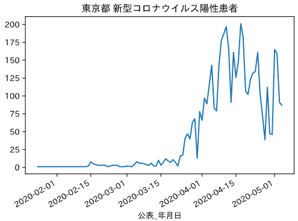
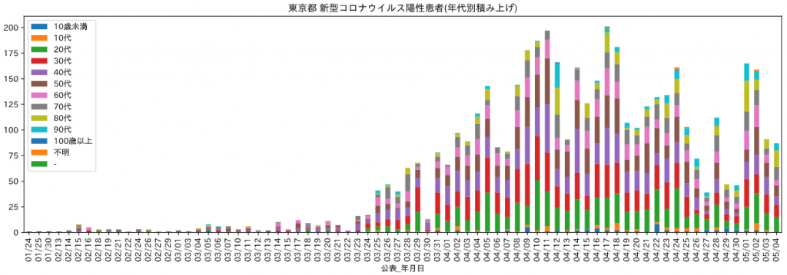

Python pandasのデータフレームの学習がてら表題のオープンデータを用いて日時の陽性者数を年代別に積み上げグラフとして出力するスクリプトを下記リンク先に掲載。


<!-- truncate -->


[yu-kun/covid19-tokyo-opendata: Source code to a distribution of patients by age group created with Python Jupyter on the basis of Tokyo Open Data Catalogue Site csv file.](https://github.com/yu-kun/covid19-tokyo-opendata)

VS codeのdev containerの設定ファイルも同梱することで、環境構築を容易に可能。

### 実行結果例





### ソースコード


```python
 # %% import matplotlib.pyplot as plt import japanize_matplotlib import pandas as pd

# %% url = 'https://stopcovid19.metro.tokyo.lg.jp/data/130001_tokyo_covid19_patients.csv' df = pd.read_csv(url) df['公表_年月日'] = pd.to_datetime(df['公表_年月日'], format='%Y-%m-%d') # 未使用予定の列を削除 del df['No'], df['全国地方公共団体コード'], df['市区町村名'], df['発症_年月日'], df['患者_属性'], \ df['患者_状態'], df['患者_症状'], df['患者_渡航歴の有無フラグ'], df['備考']

# %% df

# %% # 日別の陽性者数の集計 se_dairy = df.groupby('公表_年月日').size() se_dairy

# %% # 特定日の陽性者数を出力 se_dairy['2020-04-17']

# %% # 日別の陽性者数の棒グラフ ax_dairy = se_dairy.plot(title='東京都 新型コロナウイルス陽性患者') fig = ax_dairy.get_figure() fig.savefig('data/daily_patient_number_' + df['公表_年月日'].max().strftime('%Y%m%d') + '.png', dpi=100)

# %% df_tmp = df[['公表_年月日', '患者_年代']] # 人数列を追加 df_tmp['人数'] = 1 # 行と列を指定してピボット（再形成） df_tmp2 = df_tmp.pivot(columns='患者_年代', values='人数' ) # columns方向(axis=1)に結合し欠損値を0置換 df_tmp3 = pd.concat([df_tmp['公表_年月日'], df_tmp2], axis=1).fillna(0) # 列順序の変更 df_tmp3 = df_tmp3[['公表_年月日', '10歳未満', '10代', '20代', '30代', '40代', '50代', '60代', '70代', '80代', '90代', '100歳以上', '不明', "-"]] # 日別集計 df_age = df_tmp3.groupby('公表_年月日').sum()

# %% df_age1 = df_age.copy() df_age1.index = df_age.index.strftime('%m/%d') ax_age = df_age1.plot(kind='bar', stacked=True, figsize=(17,5), title='東京都 新型コロナウイルス陽性患者(年代別積み上げ)') fig = ax_age.get_figure() fig.savefig('data/distribution_of_patients_by_age_group_' + df['公表_年月日'].max().strftime('%Y%m%d') + '.png', dpi=100)

# %%
```


