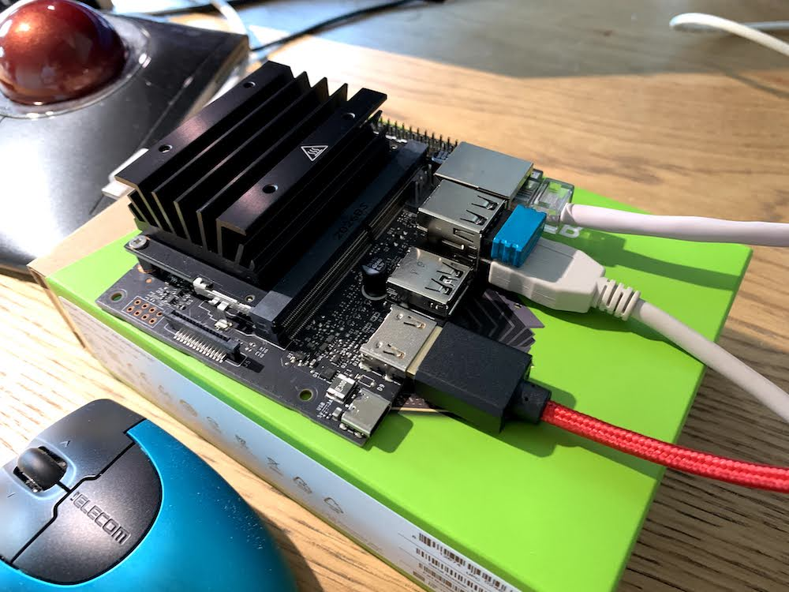
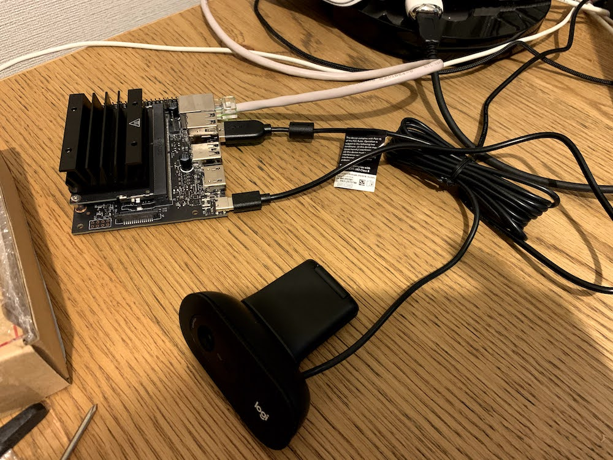

この記事は[MDCアドベントカレンダー](https://qiita.com/advent-calendar/2020/mdc)22日目の記事となる。

## はじめに

- 表題のJetson nanoとはNVIDIA製の128-core GPU、Quod-core ARM CPUを持つシングルボードコンピュータ (ref: [Wikipedia link](https://ja.wikipedia.org/wiki/%E3%82%B7%E3%83%B3%E3%82%B0%E3%83%AB%E3%83%9C%E3%83%BC%E3%83%89%E3%82%B3%E3%83%B3%E3%83%94%E3%83%A5%E3%83%BC%E3%82%BF))。
    - 公式 製品概要：[最新の Jetson 製品の購入 – NVIDIA Developer](https://www.nvidia.com/ja-jp/autonomous-machines/jetson-store/)
    
    - 公式 Jetson nano 2GB 仕様：[Jetson Nano 2GB Developer Kit | NVIDIA Developer](https://developer.nvidia.com/embedded/jetson-nano-2gb-developer-kit)

- 本記事では2020年10月5日に発売発表されたJetson nano 2GBとUSBカメラを用いてWeb動画ストリーミング機能をPython Flaskで構築するためのソースコード等を紹介するもの。


<!-- truncate -->


## 機能概要

- Webブラウザ経由でUSBカメラでキャプチャした動画(連続画像)を表示

- 音声なし、動画の同時表示クライアント数は1つ

## 実行時のイメージ

紹介するソースコードの実行時のイメージは以下の通り。自身が想定した以上にヌルヌル動くので驚きだった。

<figure>


<figcaption>

USBカメラのキャプチャ内容をWebブラウザでストリーミング配信中

</figcaption>

</figure>

## 実行環境

本体(+ソフトウェアのバージョン)と付属部品を紹介する。

### Jetson nano 2GB 本体

[NVIDIA Jetson Nano 2GB 開発者キット JETSON NANO 2GB DEV KIT](https://amzn.to/3rgj8M6)

初期設定時はモニタ・キーボード・マウス等ケーブルに囚われるイメージだが、VNC, ssh周りの設定が完了すれば2枚目の画像の通り多少はスッキリする。

<figure>



<figcaption>

初回起動・初期設定時

</figcaption>

</figure>

<figure>



<figcaption>

リモート開発環境の設定後

</figcaption>

</figure>

#### OSバージョン


```bash
 $ cat /etc/nv_tegra_release # R32 (release), REVISION: 4.4, GCID: 23942405, BOARD: t210ref, EABI: aarch64, DATE: Fri Oct 16 19:44:43 UTC 2020 $ dpkg-query --show nvidia-l4t-core nvidia-l4t-core 32.4.4-20201016124427 
```


#### Python、パッケージバージョン

主に使用するのはOpenCV、Flask、uWSGIとなる。


```bash
 $ python3 -V Python 3.6.9 $ pip -V pip 20.3.3 from /usr/local/lib/python3.6/dist-packages/pip (python 3.6) $ pip freeze | grep -e Flask -e uWSGI Flask==1.1.2 uWSGI==2.0.19.1 $ python Python 2.7.17 (default, Sep 30 2020, 13:38:04) [GCC 7.5.0] on linux2 Type "help", "copyright", "credits" or "license" for more information. >>> import cv2 >>> print(cv2.__version__) 4.5.0 
```


### USBカメラ

最近発売されて価格と性能が釣り合っているロジクールC505を使用。赤ちゃんモニター用途だとより広角が欲しくなるかもだが、トライアルであれば十分な仕様。

[ロジクール ウェブカメラ C505 HD 720P 自動光補正 ロングレンジマイク 2mの長いUSB接続ケーブル プラグアンドプレイ WEBカメラ ZoomやSkype等主要なビデオ通話アプリに対応 国内正規品 2年間メーカー保証](https://amzn.to/34wli0l)

### その他部品

microSDカードと電源ケーブル。欲を言えばケースも欲しかったが、2020年12月時点2GBモデルに対応する適当なケースが無く裸で使用している。

- [Smraza Raspberry Pi 4 USB-C (Type C）電源、5V 3A ラズベリーACアダプター RPi 4b Model B 1GB / 2GB / 4GB/ 8GB適用 PSE取得](https://amzn.to/38lUQri)

- [Samsung EVO Plus 128GB microSDXC UHS-I U3 100MB/s Full HD & 4K UHD Nintendo Switch 動作確認済 MB-MC128GA/ECO 国内正規保証品](https://amzn.to/34wzRB6)

## ソースコード

構成としてはFlask Webアプリ内でUSBカメラのキャプチャ画像を60fpsで出力する構成となる。

### ファイル・フォルダ構成

実際には下記以外に開発環境であるVS code用の設定ファイル、Web公開の為のBasic認証用のNginxコンテナ周りの設定ファイルやDockerfile、docker-compose.ymlファイル等があるが、表題とズレる為割愛する。

```
~/code/jetson-web-stream$ tree
├── app.pid  # uwsgi経由での起動時に作成自動作成される
├── app.py
├── templates
│ └── index.html
├── uwsgi.ini
```

### app.py - Flaskアプリ本体

[Interface 2021年1月号](https://amzn.to/3nCs6ks)にbottleフレームワーク(FW)版の記載があるが、私が得意なFWはDjangoかFlaskの為、メインの処理部分を参考にしつつFlask-nizeしたもの。

ページ構成としてはルートディレクトリ'/'にアクセス時に呼び出されるindex.htmlテンプレート内のimgソースとしてvideo\_recvメソッドが呼び出される。当該ページ(画像)はサーバのプッシュ通信で描画内容を更新させる為mimetype='multipart/x-mixed-replace;boundary=frame'指定とし、\_\_main()処理内のyield句で生成されるjpg画像が60fpsで切り替わる流れ。


```python
 from flask import Flask, render_template, Response import cv2 import time

app = Flask(__name__)

def __main(): cap = cv2.VideoCapture(0) cap.set(cv2.CAP_PROP_FRAME_WIDTH, 640) # 1280 cap.set(cv2.CAP_PROP_FRAME_HEIGHT, 360) # 720 if not cap.isOpened(): # ビデオキャプチャー可能か判断 print("Not Opened Video Camera") exit()

while True: ret, img = cap.read()

if not ret: # キャプチャ失敗時に終了 print("Video Capture Err") break

# キャプチャ画像を出力 result, jpgImg = cv2.imencode('.jpg', img=img, params=[int(cv2.IMWRITE_JPEG_QUALITY), 80]) # 0 - 100 yield b'--frame\r\n' + b'Content-Type: image/jpeg\r\n\r\n' + bytearray(jpgImg) + b'\r\n\r\n' time.sleep(1 / 60)

cap.release() cv2.destroyAllWindows()

return 0

@app.route('/') def index(): return render_template('index.html')

@app.route('/video_recv') def video_recv(): return Response(__main(), mimetype='multipart/x-mixed-replace;boundary=frame')

if __name__ == '__main__': print(cv2.__version__) app.run(host='0.0.0.0', port=8080, debug=True)
```


### index.html - Flask アプリのテンプレート


```html
 <!DOCTYPE html> <html> <head> <title>Ba!</title> <meta charset="UTF-8"> <meta name="viewport" content="width=device-width, initial-scale=1"> <style type="text/css"> <!-- #ID_01{ text-align : center; }

#ID_TITLE{ font-size : 10pt; text-align : center; } --> </style> </head> <body> <div id="ID_TITLE">Web Streaming by Single board computer "Jetson nano 2GB"</div> <div id="ID_01"> </div> </body> </html> 
```


### uwsgi.ini - Flask用APサーバー

開発環境でのテスト実行であればif **name** == '**main**':句内を直接実行で構わないが、本番運用時は以下のWARNINGの通り推奨されない。


```bash
 $ python3 app.py 4.5.0 * Serving Flask app "app" (lazy loading) * Environment: production WARNING: This is a development server. Do not use it in a production deployment. Use a production WSGI server instead. ＜攻略＞ 
```


[Development Server — Flask Documentation (2.0.x)](https://flask.palletsprojects.com/en/master/server/)

uwsgi.ini記述は以下の通り。


```bash
 [uwsgi] master = true http=0.0.0.0:8080 wsgi-file = app.py callable = app processes = 1 threads = 1 pidfile=./app.pid 
```


## 実行方法


```bash
 # uwsgiサーバーの起動 $ uwsgi uwsgi.ini &amp;amp;amp; [1] 18387

# 起動プロセス番号を確認 $ cat app.pid 18387

# uwsgiサーバーの停止 $ uwsgi --stop app.pid 
```


コマンド末尾に&を付与することでバックグラウンドでの実行が可能。尚、実行時のリソース使用状況は以下の通り。これまで動画像処理の経験があまりなく、必要リソースの肌感覚が掴めなかった為参考となった。配信のマルチスレッド化とアクセス数の増加時にどのように推移するかは気になる点である。


```bash
 $ top top - 22:20:37 up 1 day, 13:11, 2 users, load average: 0.39, 0.19, 0.19 Tasks: 248 total, 1 running, 247 sleeping, 0 stopped, 0 zombie %Cpu(s): 5.7 us, 0.6 sy, 0.0 ni, 92.4 id, 0.0 wa, 1.1 hi, 0.2 si, 0.0 st KiB Mem : 2027368 total, 467944 free, 598448 used, 960976 buff/cache KiB Swap: 5207980 total, 4990740 free, 217240 used. 1352596 avail Mem

PID USER PR NI VIRT RES SHR S %CPU %MEM TIME+ COMMAND 18975 xx 20 0 1351516 66968 25232 S 19.2 3.3 0:02.64 uwsgi 5343 root 20 0 6530024 44920 20744 S 0.7 2.2 56:16.21 Xorg 19528 xx 20 0 10148 3928 3192 R 0.7 0.2 0:00.12 top 4405 root -51 0 0 0 0 S 0.3 0.0 33:22.67 sugov:0 5676 xx 20 0 371972 19496 15068 S 0.3 1.0 11:05.43 vino-server 5713 xx 20 0 361252 12776 9312 S 0.3 0.6 61:26.18 clipit 5977 xx 20 0 499780 3108 2004 S 0.3 0.2 18:58.24 python3 15604 root 20 0 0 0 0 S 0.3 0.0 0:01.16 kworker/u8:2 18153 systemd+ 20 0 8732 3380 2060 S 0.3 0.2 0:01.83 nginx 18979 xx 20 0 988352 45204 1628 S 0.3 2.2 0:00.03 uwsgi 1 root 20 0 161208 6112 4264 S 0.0 0.3 0:09.15 systemd 2 root 20 0 0 0 0 S 0.0 0.0 0:35.86 kthreadd 3 root 20 0 0 0 0 S 0.0 0.0 0:03.62 ksoftirqd/0 5 root 0 -20 0 0 0 S 0.0 0.0 0:00.00 kworker/0:0H 7 root 20 0 0 0 0 S 0.0 0.0 1:33.45 rcu_preempt 8 root 20 0 0 0 0 S 0.0 0.0 0:03.07 rcu_sched 9 root 20 0 0 0 0 S 0.0 0.0 0:00.00 rcu_bh 10 root rt 0 0 0 0 S 0.0 0.0 0:00.02 migration/0 $ free -m total used free shared buff/cache available Mem: 1979 584 457 18 938 1321 Swap: 5085 212 4873 
```


## 作成動機・背景

これまでシングルボードコンピュータを扱ったことがなく、書籍やWeb上の活用事例を見ながら漠然とした興味に留まっていたがJetson nano 2GBのお手頃価格が背中を押した感じ。

我が家はFamily budgetのみの為、妻とJetson nano 2GBの活用方法を相談している中で、表題のアプリはコロナ禍で英露から来日出来ない妻の両親が「何時でもお孫さんと一緒だよ」と感じられるツールにもなるとのことで、了解してもらった。

ただ、実際に設置してみると現時点は我々夫婦が専らのユーザーとなり生後4ヶ月の息子の寝返りチャレンジをチラ見する事となった。。(今の所寝返るが腕抜きが出来ず最後に泣いて両親駆けつけレスキュー)
