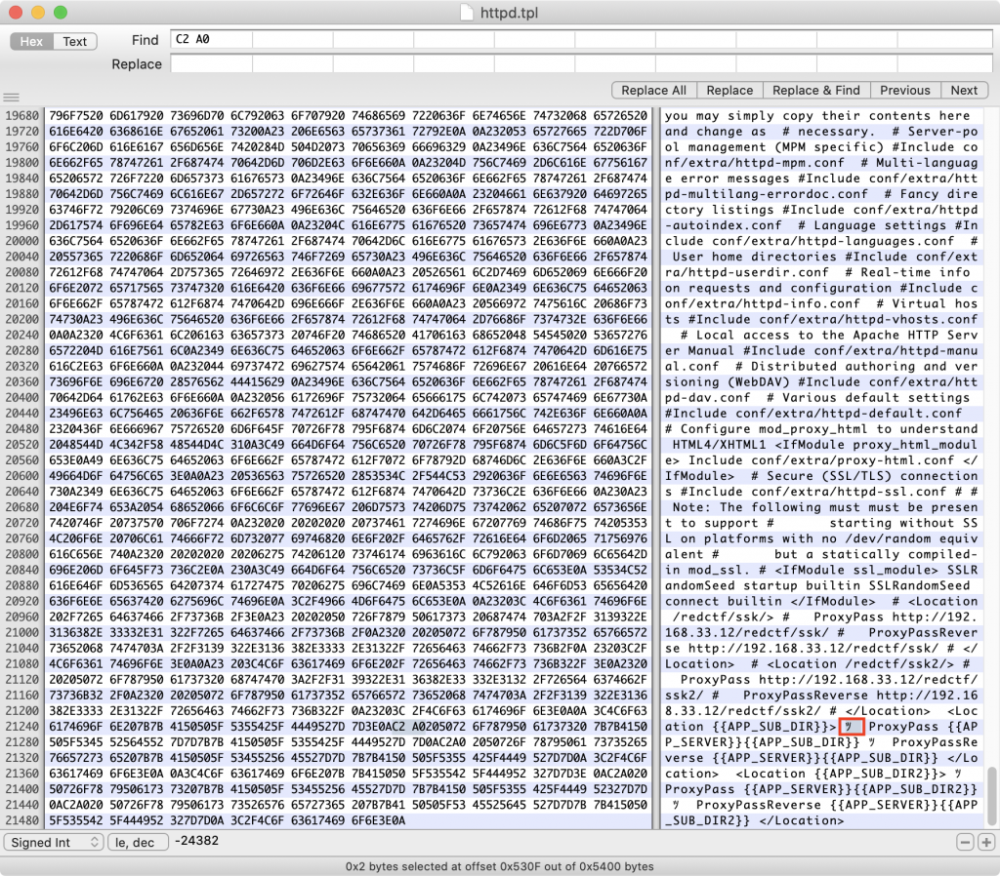

表題のエラーで嵌った為、解決法を共有するもの。

## 事象

Apache httpdの公式Docker imageであるhttpd:2.4.46において、/usr/local/apache2/conf/httpd.confにカスタム設定を記述の上コンテナ起動した際に以下のエラーメッセージが出力しhttpdプロセスが起動せず。


<!-- truncate -->


```bash
 > Executing task: docker logs -f 8b75027a04df9b312e5e371cc553e8caecc57cafb7f90829f19d4587e974effb < AH00526: Syntax error on line 558 of /usr/local/apache2/conf/httpd.conf: Invalid command '\xc2\xa0', perhaps misspelled or defined by a module not included in the server configuration AH00526: Syntax error on line 558 of /usr/local/apache2/conf/httpd.conf: Invalid command '\xc2\xa0', perhaps misspelled or defined by a module not included in the server configuration AH00526: Syntax error on line 558 of /usr/local/apache2/conf/httpd.conf: Invalid command '\xc2\xa0', perhaps misspelled or defined by a module not included in the server configuration AH00526: Syntax error on line 558 of /usr/local/apache2/conf/httpd.conf: Invalid command '\xc2\xa0', perhaps misspelled or defined by a module not included in the server configuration ＜後略(docker-compose.ymlでrestart: unless-stopped設定した為、エンドレスに出力された)＞ 
```


## 原因

VScodeやテキストエディタで対象のhttpd.confファイルを確認しても'\\xc2\\xa0'そのものの文字列はなく、先頭の\\xをUTF-8の16進数表記のエントリポイントとすると、文字コードC2A0は[non-breaking space, NBSP](https://en.wikipedia.org/wiki/Non-breaking_space)と分かる。

今回このhttpd.confファイルの編集時、MS PowerPointファイル中のテキストボックスの文字列をコピペした際に混入したもの。

## 解決法

テキストエディタでは上手く削除できなかった為、Mac用のバイナリエディタある[Hex Fiend](https://apps.apple.com/jp/app/hex-fiend/id1342896380?mt=12)で削除した。

<figure>



<figcaption>

画像右下の赤枠の「ﾂ 」がC2A0の箇所としてヒット

</figcaption>

</figure>
