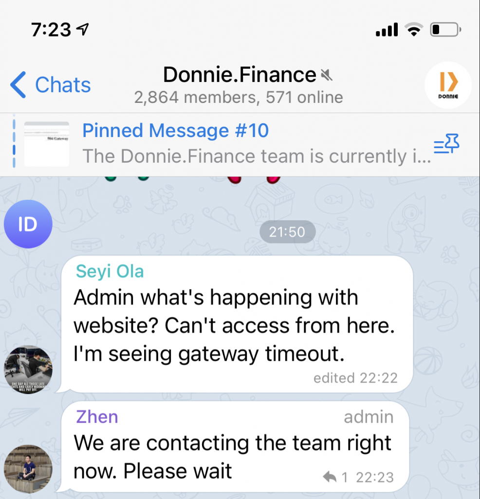
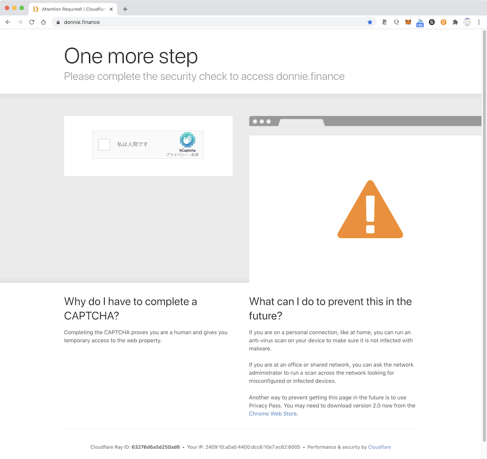
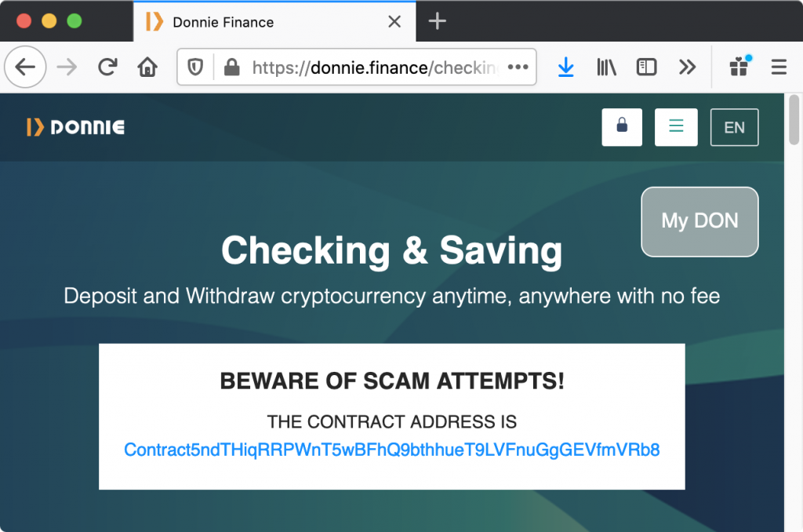
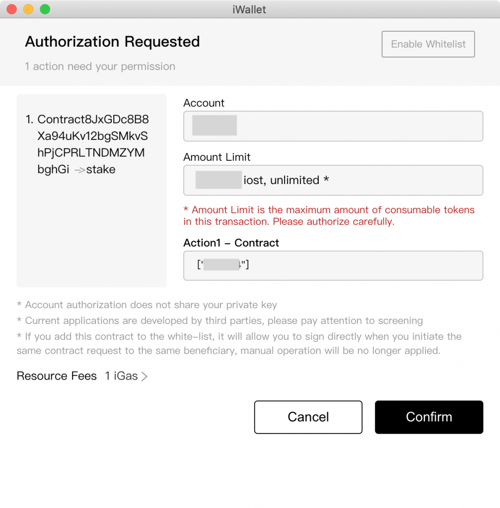
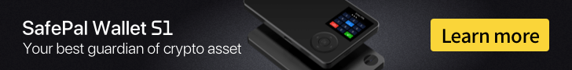

公開情報を元に記載しています。

## 事象内容

2021年3月17日 JST22:22頃からWebサイト[donnie.finance](https://donnie.finance/)へのアクセスできない事象が発生。


<!-- truncate -->


<figure>



<figcaption>

Donnie Finance公式Telegramグループ(公開)におけるユーザの第一報とadmin担当間のやり取り

</figcaption>

</figure>

その後一部のTwitterユーザー側でも気づき始める。

https://twitter.com/askuwai/status/1372180624589557760

HTTPレスポンスステータスコードは504 Gateway Time-outや502 Bad Gateway等。nmapで443 port (HTTPS)がオープンであること、及びクライアントへはレスポンス自体が返っていることから、ping不通はFWもしくはサーバ側の設定によるものと推測。

## ユーザー側への影響

本記事公開時点で確認できている影響は以下の通り。

- [donnie.finance](https://donnie.finance/)サイト掲載のIOST等取り扱い銘柄のStaking、及びDONのharvestingに係る状況照会や入出金操作(Deposit / withdraw)が不可

- 但しユーザーが保有している暗号資産への影響(消失・窃取)は無し

<figure>

https://twitter.com/DonnieFinance/status/1372260955745255424

<figcaption>

公式アカウントからの第一報

</figcaption>

</figure>

## Donnie Finance側の対応

サイトが復旧したのは翌3月18日 JST9:04頃となるが、後述のツイートの通り3月18日 JST15:37頃にサイトダウンが再発。3月19日 JST0時頃 再復旧を確認。

https://twitter.com/DonnieFinance/status/1372338068942774274

https://twitter.com/DonnieFinance/status/1372437004693032963

2021年3月20日(土)追記：現在はcloudflareによるDDoS対策が導入されている。

<figure>



<figcaption>

Webサイトへのアクセス時にCAPTCHA入力要

</figcaption>

</figure>

## 発生原因

3/18時点で公式プレスは無く、2度目のサイトダウン時に上記の投稿のみ。DDoS (Distributed Denial of Service)攻撃との説明。但し事実検証は外部からは不可。

## 所見

インシデントレスポンスとして公式の一報や影響見極めが遅い点はユーザー側をやきもきさせた可能性あり。但し暗号資産の影響有無をユーザー側でも状況確認できるのはブロックチェーン上のスマートコントラクト技術の大きなメリットであることも再認識されたと思われる。

DeFiサービスプロバイダー側はサービスサイト上でユーザー側の資金決済情報(ユーザーアカウントのプライベート鍵\[秘密鍵\])を保管を行う必要はなく、あくまでクライアント側のウォレット(大抵のDeFiはブラウザアドオン機能を用いる)をインターフェイスとした資金移動機能をスマートコントラクトで提供するのみの為、適切な実装であれば本事象はサイトダウンに留まる。

留意しなけれならない点として、ユーザー側がブロックチェーン上の暗号資産の状態を確認するには正規のコントラクトアドレスを**事前**に押さえておく必要があること。

<figure>



<figcaption>

公式サイト上のコントラクトアドレスの掲示

</figcaption>

</figure>

サイバー攻撃等を受けやすい業界でもあるため、大事なコントラクトアドレスをサービス提供サイトでの掲載だと、当該サイトが改ざんされた場合やDNSハイジャック攻撃で別サーバへ誘導された場合にユーザーが悪意のあるコントラクトアドレスを掴まされる可能性がある。その為、複数媒体でコントラクトアドレスを掲載しておくのがベストプラクティスと考える。

> **Don Token Contract :** [_Contract5ndTHiqRRPWnT5wBFhQ9bthhueT9LVFnuGgGEVfmVRb8_](https://www.iostabc.com/token/don?page=1&size=50&order=asc)
> 
> [https://donnie-finance.medium.com/donnie-finance-and-iost-announcing-don-airdrop-for-iost-holders-f168e9f608a5](https://donnie-finance.medium.com/donnie-finance-and-iost-announcing-don-airdrop-for-iost-holders-f168e9f608a5)

今回のケースでは上記がDONのトークンコントラクトとなりその情報はIOSTABCサイトで誰でも閲覧可能。

- [Token:don](https://www.iostabc.com/token/don?page=1&size=50&order=asc)

- [Contract5ndTHiqRRPWnT5wBFhQ9bthhueT9LVFnuGgGEVfmVRb8](https://www.iostabc.com/contract/Contract5ndTHiqRRPWnT5wBFhQ9bthhueT9LVFnuGgGEVfmVRb8?page=1&size=50&order=asc)

ここから今回のDONトークンを作成したIOSTアカウントは[donmanager](https://www.iostabc.com/account/donmanager)と分かる。当該アカウントのプライベート鍵\[秘密鍵\]さえ適切に保管されていればコントラクトの改ざんは不可。

また、ブラウザウォレットでの操作承認画面や自アカウントのトランザクション取引参照することで、DonnieFinance上のStakingトークン毎のコントラクトアドレスを確認できる。例としてIOSTのStaking 01 ( [https://donnie.finance/trade/iost01](https://donnie.finance/trade/iost01) ) のコントラクトアドレスは

[Contract8JxGDc8B8Xa94uKv12bgSMkvShPjCPRLTNDMZYMbghGi](https://www.iostabc.com/contract/Contract8JxGDc8B8Xa94uKv12bgSMkvShPjCPRLTNDMZYMbghGi?page=1&size=50&order=asc)

<figure>



<figcaption>

例：iWallet(donnie.financeサイトのWebアプリ上のホップアップ画面**ではない**)のスマートコントラクトの実行確認画面。左側にコントラクトアドレスが記載。話ずれるがiGas代安！！(Ethereum脳より)

</figcaption>

</figure>

なお、各コントラクトコードもIOSTABCページのCONTRACT CODEタブから確認可能。


```javascript
const DON_TOKEN = 'don';
const DON_ADDRESS = 'Contract5ndTHiqRRPWnT5wBFhQ9bthhueT9LVFnuGgGEVfmVRb8';
const STAKE_TOKEN = 'iost'; //IOST
＜中略＞
```


正規のDON tokenアドレスを指していることを確認できる。IOSTのコントラクトアドレスは接頭辞にContract....がついているので検索が容易なのが良い。改ざんする人はコードの冒頭に高らかにコントラクトアドレスを記載しないだろうし。

## 最後に

以下にハードウェアウォレットのアフィリエイトリンクを置いておくので良ければ活用下さい。割引特典あり。

[](https://shop.safepal.io/products/safepal-hardware-wallet-s1-bitcoin-wallet?ref=yukun) 

