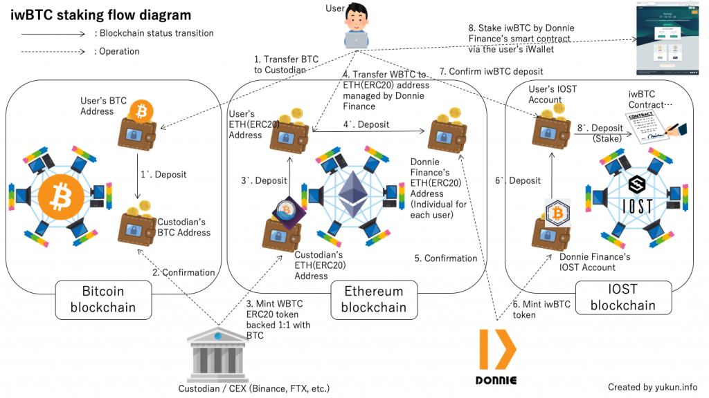
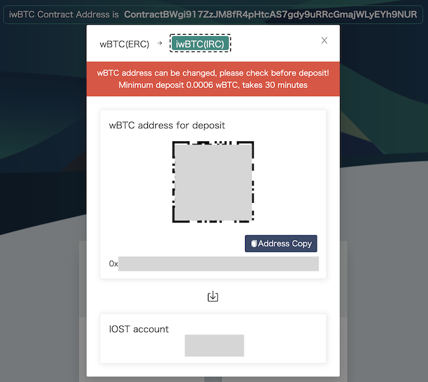
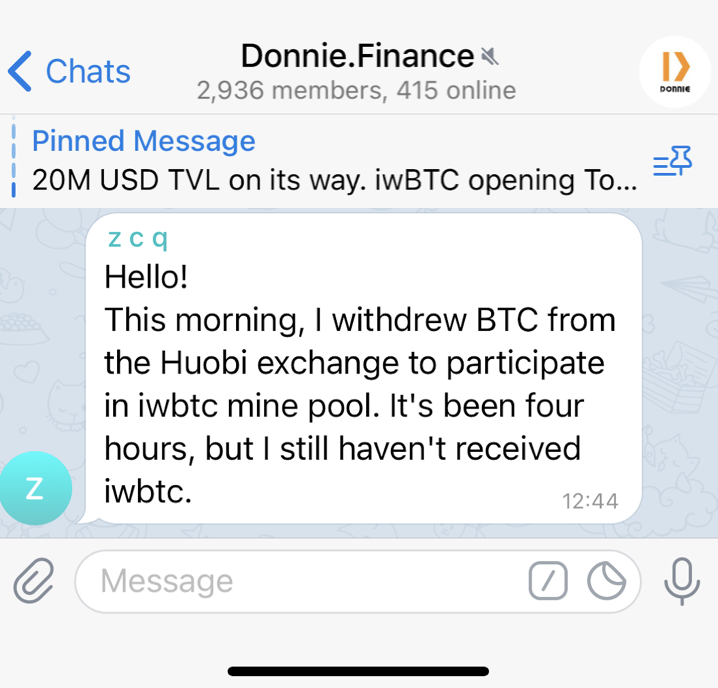
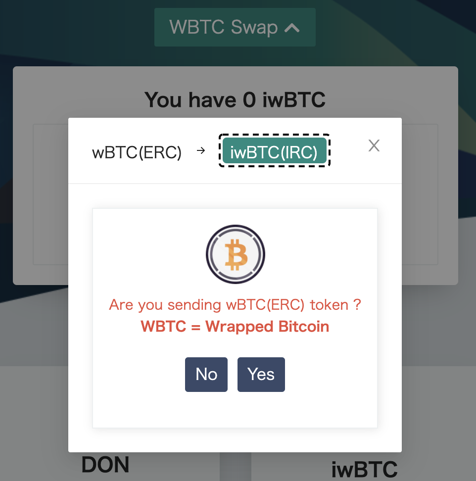

2021年3月23日(火)にDeFi プラットフォームのDonnie FinanceがiwBTC (IOST Wrapped BTC)のステーキング(staking)によるDON の配布サービスを開始。本記事ではiwBTC定義、入金(Deposit)フロー、想定リスクについて公開情報を元に簡単にまとめておくもの。

https://twitter.com/donniefinance/status/1373854156788621316?s=21

## iwBTCトークンとは

Donnie Finance発行の[WBTC (ERC20規格)](https://wbtc.network/)にbackedするIRC規格のトークン。間接的にBitcoin (BTC)の価値をIOSTチェーン上で取り扱うためのもの。トークンのコントラクトアドレスは以下の通り。

- [Token:iwbtc](https://www.iostabc.com/token/iwbtc?page=1&size=50&order=asc)

- [ContractBWgi917ZzJM8fR4pHtcAS7gdy9uRRcGmajWLyEYh9NUR](https://www.iostabc.com/contract/ContractBWgi917ZzJM8fR4pHtcAS7gdy9uRRcGmajWLyEYh9NUR?page=1&size=50&order=asc)

作成アカウントは[donmanager](https://www.iostabc.com/account/donmanager?activetab=1&listtab=0&page=1&rowsPerPage=20)とDONトークンの発行元アカウントと同じ。

## iwBTCの入金・ステーキングフロー

ステーキングページ( [https://donnie.finance/trade/iwbtc](https://donnie.finance/trade/iwbtc) ) 上のWBTC SwapメニューよりiwBTCへ変換を行うためのWBTC用Depositアドレスが提供される。昨日試しに表示されたアドレスを[Etherscan](https://etherscan.io/)で確認したが、0残高ということで、サイトに記載の通りユーザー個々に生成されるアドレスと思われる。

BTC, [WBTC](https://wbtc.network/), iwBTCの関係性を踏まえたフロー図は以下の通り。

- No.1〜3：WBTCを保有していない場合はBTCをカストディアン経由で入手、と図中はかしこまった表現をしているが、言い換えればBTCを[Binance](https://www.binance.com/ja/register?ref=F7HUYR9G), [FTX](https://ftx.com/#a=14796040)等のWBTC取り扱い取引所に送金してBTC→WBTCトレードをする。WBTCの公式上の定義は"Wrapped Bitcoin (WBTC) is the first ERC20 token backed 1:1 with Bitcoin"だが、取引所上は需給バランスによっては0.0X%程度の変動はある。

- No.4〜4｀：取引所経由でWBTCを入手した場合はNo.3｀をスキップして直接No.4, 4｀を実施する。送金先のアドレスはDonnie Finance上で表示されているETH (ERC20)アドレスとなる。

<figure>

<figcaption>

BTC Swap画面例。最低入金額は0.0006 wBTC、入金確認には約30分

</figcaption>

</figure>

## iwBTCステーキングのリスク

一般的なDeFi・スマートコントラクトのリスク(※)の他に考えられるものを2点ほど挙げておく。

※参考サイト

- [DeFi（分散型金融）に内在する10のリスク それぞれのリスク対応の考え方 | HashHub Research](https://hashhub-research.com/articles/2020-11-19-ten-risks-defi-faces)

- [流動性供給、Impermanent Loss、高APYの仕組みから、ファーミングのリスクリターンを正しく理解する | HashHub Research](https://hashhub-research.com/articles/2021-04-16-about-yield-farming)

### 1\. WBTC Swapオペレーションミスリスク

現状IOSTのスマートコントラクトにクロスチェーンスワップを実装できるような機能は無いので(将来的にはPolkadot等とクロッシングしてくと思われる)、ETHアドレスへのDeposit経由という力技で対応している。Donnie Finance社側もクローラ等である程度自動化はしているだろうが。WBTCやERC20規格等この辺りの理解が無いユーザーはBTCを直にETHアドレスへ送金するミスを冒す可能性がある。

<figure>

<figcaption>

公式Telegramでのユーザーの照会を抜粋

</figcaption>

</figure>

上記のケースがBTCからの送金にETHアドレスを指定していたのであれば、当然チェーン越えは出来ないので対象BTCは消失扱いとなる。合掌。。。未来の量子コンピュータによる計算か超大なレインボーテーブルに運良くETH(ERC20)アドレス文字列に該当するBTCプライベート鍵\[秘密鍵\]文字列がわかれば動かせるかもと思いつつ、改めて考えるとBTCとETHのアドレス書式の違いもあり、無理だろう。。

<figure>

<figcaption>

2021年3月24日 JST21:00頃に確認したところ、注意画面が設けられていた。やらかしあったのだろうな。。

</figcaption>

</figure>

### 2\. Donnie Financeのカウンターパーティリスク

暗号資産取引所、Dapp提供元、暗号資産運用会社、カストディアン等基本的に外部委託部分には常にこの手のリスクが付きまとうが、今更論うのはiwBTCの定義・ホワイトペーパー的な文書が公式サイトやメディアから確認できなかった為。

因みにERC20 WBTCはBTCと1:1 backedとなるよう運営されており、実際に1:1均衡が取れているかは自主点検だけでなくDAOメンバーによる監査対応を行っている。

> DAO members will publicly audit the WBTC tokens to make sure that the balances in the custodian wallet match the balances in the smart contract.
> 
> [WBTC: A Community Effort to Bring Bitcoin to Ethereum](https://blog.kyber.network/wbtc-a-community-effort-to-bring-bitcoin-to-ethereum-b9b63e3b86e6)

WBTCの運営体制と比較するとリスク高と言わざる負えない。(1:1 backedか否かの記載もない。。)

また、現状ETHのGas代高騰は継続しており、DONの価格変動性も鑑みると少額投資の場合は手数料負けする点もデメリットと考える。

上述の見解は2021年3月24日時点の情報を元に記載しており、将来の状況の変化により見解が変わる可能性もある点はご留意頂きたい。
