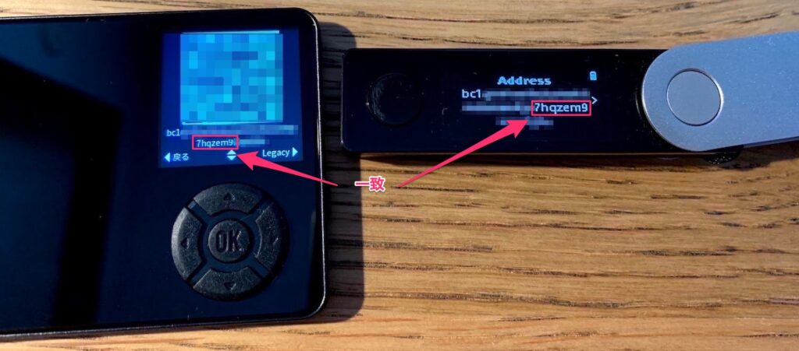

[Ledger Nano X](http://ledger.refr.cc/yukuninfo)と[SafePal S1](https://shop.safepal.io/products/safepal-hardware-wallet-s1-bitcoin-wallet?ref=yukun)を入手し表題を実機検証できたので備忘で記載するもの。

<!-- truncate -->

下記の写真は同一ニーモニックフレーズ(mnemonic phrase)を設定した両ハードウェアウォレットのBTCアドレスの表示画面。掲載の都合上一部モザイクを掛けているが完全一致していることを確認できた。EthereumのETHアドレスについては写真は割愛するがBTCと同様に両ウォレットで生成されるアドレスの完全一致を確認済。

もしハードウェアウォレットのバックアップを実施したい場合は同一メーカーの同機種を複数用意するより、今回の組み合わせのように別メーカー別機種で用意したほうがカウンターパーティリスクを低減できる。

上記の結論については分かっている人は今更感あるが、同一アドレスが生成できる仕掛けはアドレス生成アルゴリズムが両ウォレットともBIP39(アドレス生成アルゴリズム規格)、BIP44(アドレス階層規格)で同じである為。(※BIP: Bitcoin Improvement Proposal)

以下は上記検証に関わるドキュメントを紹介。

## BIP39 / 44の公式ドキュメント

- BIP39: [https://github.com/bitcoin/bips/blob/master/bip-0039.mediawiki](https://github.com/bitcoin/bips/blob/master/bip-0039.mediawiki)

- BIP44: [https://github.com/bitcoin/bips/blob/master/bip-0044.mediawiki](https://github.com/bitcoin/bips/blob/master/bip-0044.mediawiki)
    - Derivation Path書式：m / purpose' / coin\_type' / account' / change / address\_index

## LedgerのBIP関連の公式ドキュメント

色々ぐぐって見たところ販売元ドメインのサポートとLedger teamが別ドメインで掲載しているドキュメントあり。

> Get the recovery phrase to restore. BIP39/BIP44 recovery phrases are supported.
> 
> [Restore from recovery phrase – Ledger Support](https://support.ledger.com/hc/en-us/articles/360015132494-Restore-from-recovery-phrase)

> Public addresPublic addresses are derived from an account's [extended public key (xpub)](https://support.ledger.com/hc/en-us/articles/360011069619) by incrementing the address index in the derivation path. Ledger Live follows the [BIP 44](https://github.com/bitcoin/bips/blob/master/bip-0044.mediawiki#Address_gap_limit) standard which prescribes that wallets look ahead 20 addresses from the last used address.
> 
> [Address gap limit – Ledger Support](https://support.ledger.com/hc/en-us/articles/360010892360-Address-gap-limit)

## SafePalのBIP関連の公式ドキュメント

> SafePal is using BIP39/44 mnemonic phrase standard so you could recover the mnemonic phrase in any other BIP39/44 compatible wallet. Here is a [recover guide video](https://www.youtube.com/watch?v=FL2MTIT5IH0&t=30s), kindly check it if you are interested in.
> 
> [Recovery & back-up - SafePal Knowledge Base](https://docs.safepal.io/safepal-hardware-wallet/security-features/software-security/recovery-and-back-up)

> SafePal is using BIP39/44 mnemonic phrase standard. However, even using the same mnemonic standard, the different derivation paths may also result in different currency addresses.  
> The following info is the derivation path of the address of the currency already supported by SafePal for your reference.  
> BTC（Legacy): m/44h/0h/0h  
> BTC(SegWit): m/49h/0h/0h  
> BTC(Native SegWit):m/84h/0h/0h  
> ETH:m/44h/60h/0h  
> DOT:m/44h/354h/0h
> 
> [Derivation paths supported by SafePal - SafePal Knowledge Base](https://docs.safepal.io/report-a-bug/derivation-paths-supported-by-safepal-1)

> You can check the spelling error of the Mnemonic through the open specification, BIP39.[https://github.com/bitcoinjs/bip39/blob/master/src/wordlists/english.json](https://github.com/bitcoinjs/bip39/blob/master/src/wordlists/english.json)
> 
> [Mnemonic phrase - SafePal Knowledge Base](https://docs.safepal.io/safepal-hardware-wallet/security-features/software-security/mnemonic-phrase#firstHeading-3)

> SafePal supports BIP44 mnemonic generation standard. If your mnemonic phrase is not a BIP44-compatible one, it cannot be recovered on a SafePal wallet. Welcome to contact us at [www.safepal.io](http://www.safepal.io/) to [submit a request.](https://docs.safepal.io/submit-a-request) if you have further questions.
> 
> [Mnemonic phrase - SafePal Knowledge Base](https://docs.safepal.io/safepal-hardware-wallet/security-features/software-security/mnemonic-phrase#firstHeading-3)

## その他参考サイト

- [BIP44が分からなくなる話 - 蟻地獄](https://mitomemel.hatenablog.com/entry/2018/12/07/000340)

- [BIP32、39、44：財布で最も一般的に使われる種の違い - 0xブロックチェーンニュース](https://ja.0xzx.com/2019060111821.html)

- [BIP39について調べてみました](https://tech.bitbank.cc/about-bip39/)
