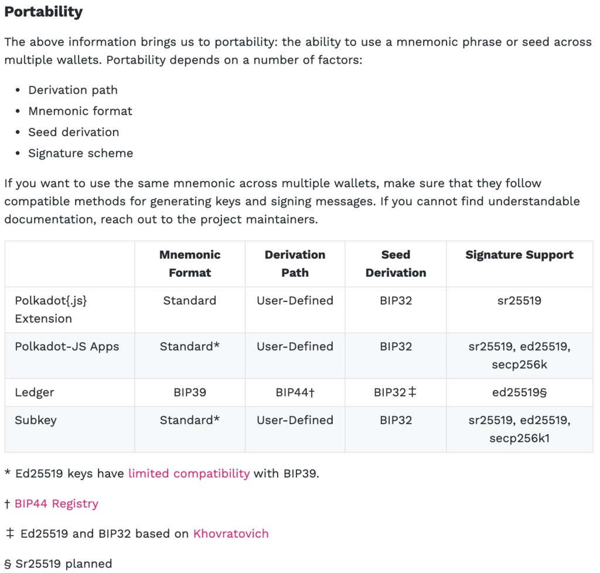

これまた[前回の記事](/blog/ledger-safepal-bip39-44)と同様に表題について実機確認できた為まとめておくもの。

<!-- truncate -->

## 事象

Ledger Nano Xで生成したBIP39/44規格のニーモニックフレーズを下表の他2種のウォレットへインポートしたところ、Ledger Nano Xで生成されたDOTアドレスと異なるアドレスが生成された。(2020年6月時点 最新FW version)

<figure>

|  | Polkadot{.js} Extension | Ledger | SafePal |
| --- | --- | --- | --- |
| Polkadot{.js} Extension | ○ | ✗ | ✗ |
| Ledger | ✗ | ○ | ✗ |
| SafePal | ✗ | ✗ | ○ |

<figcaption>

同一ニーモニックフレーズを用いたアカウント\[受信アドレス\]の可搬性。縦軸：移行元、横軸：移行先

</figcaption>

</figure>

## 原因

Polkadot{.js} ExtensionーLedger/SafePal間で可搬性が無いのは下記リンク先の表の通りアドレス生成及びDerivation Pathの規格が異なる為。

<figure>

<figcaption>

[Polkadot Accounts · Polkadot Wiki](https://wiki.polkadot.network/docs/learn-accounts#portability)

</figcaption>

</figure>

LedgerーSafePal間でもDOTアドレスが異なるのは意外な結果だった。色々ぐぐっては見たもののそれらしい記事・ドキュメントは見当たらず。可能性としてはDerivation Pathのインデックスの取り方かもとは思いつつ裏とりは出来ていない。公式サポートの回答結果を受領したら本記事に追記予定。
