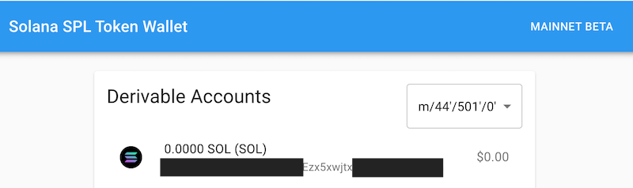
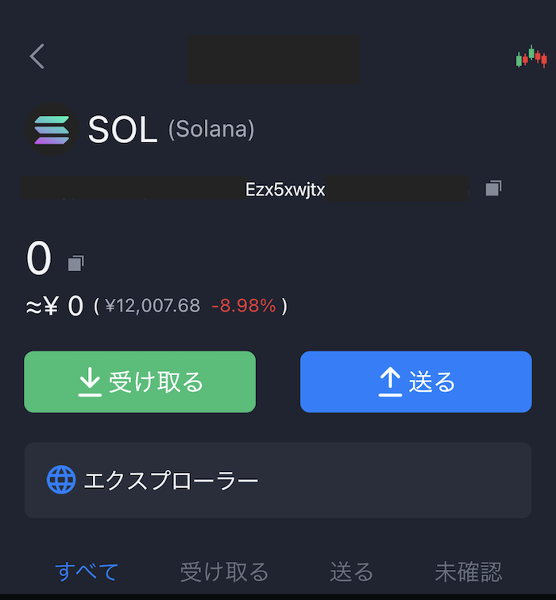

なぜならSafePalのderivation pathが **`m/44'/501'/0'`** でありsollet.ioはderivation pathの選択ができる為。そして同じ理由でLedger Nano Xでの復元は不可。derivation pathが **`m/44'/501'/0'`** でない為。

## 背景

先日SafePalのV1.0.30でSolana チェーンのサポートが発表。Ledger Nano X / SafePal S1 / ペーパウォレットユーザーとしてはバックアップ先が増える話は歓迎の為、早速復元できるか確認したもの。

> Upgrade Your SafePal S1 To On-board New Features  
> V1.0.30 (08/20/2021 mm/dd/yyyy) 1. Supports Solana mainnet, SPL tokens and DApps
> 
> [https://safepal.io/upgrade](https://safepal.io/upgrade)

## 公式ドキュメント上のDerivation pathsの記載は？

2021/09/01時点ではSolana (SOL)の記載なし。

[The derivation path of the address of the currency already supported by SafePal. – SafePal](https://safepalsupport.zendesk.com/hc/en-us/articles/360053299631-The-derivation-path-of-the-address-of-the-currency-already-supported-by-SafePal-)

## アドレス復元の確認手法

SafePalのニーモニックフレーズをSollet.ioでリストアし、作成したSPL token アドレスと合致するderivation pathオプションを特定。

<figure>

<figcaption>

Sollet.ioのニーモニックフレーズ(シードフレーズ)のインポート後のDerivable Accountsオプション画面

</figcaption>

</figure>

<figure>

<figcaption>

SafePal Wallet (iPhoneアプリ)のSPL tokenアドレス画面

</figcaption>

</figure>

上の二つの画像に記載のアドレス（一部グレーアウト）が一致していることを確認できる。

因みに、記事投稿時点ではSafePalはRaydiumに対応。今後Phantomがスマホ対応を予定するがハードウェアウォレット＋スマホでDappを操作したいニーズがある場合はSafePalは良い選択肢になるだろう。因みにLedger Nano Xの場合はスマホでSolana のDapp操作は不可で、デスクトップPCにUSB-C接続して使用する。

## 最後に

以下にハードウェアウォレットのアフィリエイトリンクを置いておくので良ければ活用下さい。割引特典あり。

- SafePal Wallet: [https://fas.st/t/asvaxcJW](https://fas.st/t/asvaxcJW)
